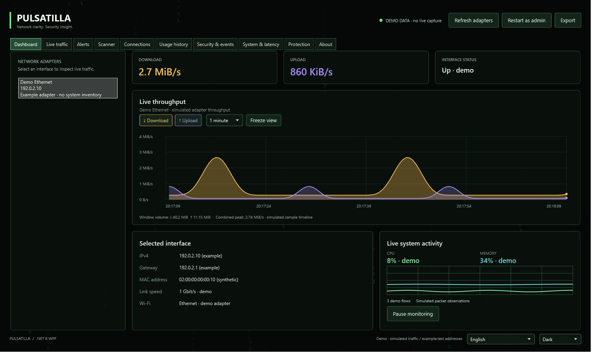

# Pulsatilla


**Network clarity. Security insight.**

[Source on GitHub](https://github.com/acsokis/pulsatilla) · [Windows downloads](https://github.com/acsokis/pulsatilla/releases) · [Support via PayPal](https://paypal.me/gaborcarter) · [English / German launch materials](docs/launch)

Network monitoring, security awareness and local exposure review in one Windows desktop app.
Pulsatilla's C#/WPF application is developed by **Gábor Kocsis / Gabor Web**, based in Germany.
Development started on **5 October 2026 at 13:55 CEST (Germany / Europe/Berlin)**,
as supplied by Gábor Kocsis.
The [origin story](docs/ORIGIN.md) records the personal-project starting point and contributor roles.
The Community application's current license is [MIT](LICENSE).
Optional paid services are a separate [integration roadmap](docs/MONETIZATION.md), not active subscriptions.

Windows network monitor and scanner built with C# and WPF on .NET 8. Targets Windows 10 and Windows 11 x64. No third-party packages are required.

## Community and continuing development

### Latest milestone — M2026-10-NETWORK-FIRST (6 October 2026)

The **1.1.0-beta.1 Community preview** contains an independent **.NET 8/WPF** workflow rework: Network Path ->
Inspect Traffic -> applications/connections/packets -> security review, with active
scans kept separate. See the [release notes](docs/releases/1.1.0-beta.1.md) for included
features, runtime requirements and experimental limits.
The [dated roadmap](docs/ROADMAP.md) and [UI/navigation plan](docs/architecture/UI-NAVIGATION.md)
track verified progress, ongoing implementation and untested hardware scenarios separately.
The 6 October release is published as a GitHub prerelease; previous downloads remain
available. It has no payment or activation gate.

Core's companion milestone freezes a private development rollback baseline and documents
the proposed native C++/Qt6, WFP and secure-P2P direction. Those later Core stages are
roadmap items. Secure Chat and advanced WFP enforcement are not added to Community here.

### Separate Core development

**Development continues in Pulsatilla Core.** This repository remains **Pulsatilla Community**
with its existing [MIT rights and notice](LICENSE); it has no payment or activation gate.
Core is **1.1.0-dev**, a separate private development preview, not a released product,
commercial sale or public download-ready upgrade. Its source and development packages
remain private. Community's feature scope is intentionally smaller than the future Core
roadmap; no existing MIT functionality is removed or made paid. Existing Community downloads retain their own
version, runtime requirements and limitations.

Implemented Core development additions include:

- An application security view with local executable metadata, SHA-256, actual Windows
  Authenticode results and explained advisory risk/UNKNOWN states.
- More precise endpoint-owner attribution and confirmed inbound/outbound/both-direction
  Core-owned firewall operations, serialized state checks and rollback handling.
- Strict VPN-profile validation/protected imports and Windows-protected credential storage.
- Bounded history/logging, retention controls and exports of retained records rather than
  only the visible table page.
- A .NET 10 development target, separate ReleaseCommercial build/package checks and an
  unsigned machine-wide MSI candidate with optional shortcuts.
- Explicit manual update checking and localized Core controls integrated into the interface.

These are development implementations with remaining production/recovery/clean-machine,
trusted-signing, rights and legal-review gates. **Core live VPN connection, kill switch,
per-application split routing and cloud/dark-web breach lookup remain unavailable.**
No active checkout, license purchase or hosted-service entitlement is implied.

Community's separately developed OpenVPN certificate-profile connection is experimental
in this beta, requires an installed supported client and passes synthetic checks only;
it is not an assurance of a verified VPN service or future Core capability.

Read the [updated origin story](docs/ORIGIN.md) and
[Python reference/source-family analysis](docs/PYTHON-REFERENCE-ANALYSIS.md) for the archive,
delivery history, both contributor roles and the limits of search/AI hypotheses.
The source-family observations do not prove copying or establish permission to reuse
the original Python archive; contributor credit and the Community MIT notice do not supply
a missing original-rightsholder grant.


## Support development

If Pulsatilla helps you, you can support its development voluntarily through
[PayPal.Me / gaborcarter](https://paypal.me/gaborcarter). You choose the amount on PayPal.
Support does not unlock features, buy a license or create a support contract; the MIT
Community application remains available without payment or activation.
The app opens the link only when clicked and does not process or store payment information.

For potential setup, diagnostics, training or integration work, contact
[Gábor Kocsis / Gabor Web on LinkedIn](https://www.linkedin.com/in/gabor-web/).
These separate services are planned; no subscription or service price is published yet.

## Download

Download the Windows x64 ZIP from [GitHub Releases](https://github.com/acsokis/pulsatilla/releases),
extract it and run `Pulsatilla.exe`. The compact package requires the **.NET 8 Windows Desktop
Runtime x64**. Community is an early release; the executable is currently unsigned.
Use monitoring normally, and restart as Administrator only for packet capture or confirmed
application firewall actions. Security findings are indicators to review, not attack proof.

## Screenshots

The following shows the earlier **1.0.x** WPF interface rendered with **synthetic demo data**.
The 1.1.0 beta has reorganized navigation. No personal
traffic, device inventory, mailbox content or user profile is included.



See the [screenshot gallery and English/German publication kit](docs/launch/README.md)
for live traffic, IP/software sources, local email review, Light mode and a German dashboard.
The kit also includes separately labeled AI-generated marketing illustrations, social posts,
SEO/GEO copy and a [commercial overview](docs/launch/commercial-overview.md).

To share the project, open [the copy-and-paste publication page](docs/launch/share.html)
locally after downloading the repository. It includes English/German LinkedIn and Facebook
posts, longer articles, copy buttons and downloadable images. On GitHub, use the
[plain-text post files](docs/launch/README.md#ready-to-copy-posts).
The complete [publication ZIP](https://github.com/acsokis/pulsatilla/releases/download/v1.1.0-beta.1/pulsatilla-publication-kit-1.1.0-beta.1.zip)
contains all texts and images with the local copy page.

## Features

- Layered Matrix rain with native WPF motion, Eco/Balanced/Off modes, fixed sprite budgets, minimized-window suspension and red anomaly/error flashes.
- Dashboard incident banner, dedicated alert center, filterable/sortable live traffic flows, and persistent admin restart access.
- Filled live throughput chart with amber download and purple upload, 1/5/15-minute views, timeline inspection, series toggles, freeze/resume and window volume/peak summaries.
- Dark theme by default, with persistent Light and Windows theme choices, matching title bars, dropdowns and rain palettes.
- Expandable top source IPs with protocol/port/local-program details, and a separate top software section with per-program remote IPs.
- About tab with the full embedded README, origin story, contributor credits and Instagram/LinkedIn/Facebook/GitHub links.
- Local event explanations: optional Ollama `qwen2.5:3b` on `127.0.0.1`; built-in offline diagnostics remain available without Ollama or an API key.
- Live CPU/RAM dashboard chart and detailed CPU/SoC, board/BIOS, GPU/driver, memory-module, disk, and network-adapter inventory.
- Adapter inventory, IPv4, gateway, MAC, link speed, and Wi-Fi status.
- Local CIDR ping sweep, fast and full TCP port scans, optional Nmap, and explicit public-IP GeoIP lookup.
- Live TCP/UDP endpoint inventory, packet capture, HEX preview, packet-size distribution, and top-source activity.
- Captured bandwidth by process, remote host, and protocol, with a local seven-day history and JSON/CSV export.
- Explicitly confirmed per-app inbound/outbound Windows Firewall block and unblock rules.
- ARP device join/leave and MAC-change review events, new-app activity, and incoming RDP alerts. Routine DNS address rotation is quiet by default.
- Local, rate-limited packet heuristics for inbound port scans, SYN bursts, repeated RDP connection attempts and possible DNS rebinding.
- Exact-executable-path application whitelist/blacklist, persisted locally, with Windows Firewall enforcement for explicit block actions.
- Offline email/phishing review with .eml/.txt import, recipient filters, trusted/blocked senders and social-engineering indicators.
- Local CSV/JSON exposure-report review filtered to explicitly watched email addresses; no external breach lookup is performed.
- Dark, high-contrast dropdowns, selected tabs and data tables.
- Wi-Fi same-name BSSID/open-authentication review, CPU, memory, drive, uptime, ping latency, and read-only firewall logs.
- Persistent crash/error diagnostics with an in-app recent-log view and direct log-folder access.
- JSON, CSV, and text report export.

Raw IP packet capture and app firewall rule changes require launching the program as Administrator; the Dashboard toolbar and System & Latency view offer an elevated restart. Other monitoring and scan features do not require elevation. Per-app attribution uses the Windows active TCP/UDP owner-PID tables, so very short-lived connections or inaccessible processes can appear as `Unattributed`. Live flow totals last for the current app session; persisted usage history starts only while packet capture is running and is kept locally under `%LOCALAPPDATA%\Pulsatilla` for seven days. Crash, warning, and security-event logs are kept under `%LOCALAPPDATA%\Pulsatilla\logs` for 14 days; packet-by-packet events are excluded. For LLM-based local explanations, install Ollama and run `ollama pull qwen2.5:3b`; the app only calls `127.0.0.1:11434`. Otherwise it uses built-in offline diagnostic rules. Hardware inventory uses Windows CIM/PowerShell; live GPU temperature/load sensors are not included without an OEM sensor provider. Nmap is optional and must be installed separately. GeoIP lookup is an explicit online request to ipapi.co; private addresses are not sent.

## Protection and graphics

Open **Protection** for application rules, network-alert preferences, Matrix Rain quality and
local email review. **App rules** in Live traffic transfers the selected executable to this view.
Rules and preferences are stored in `%LOCALAPPDATA%\Pulsatilla\protection.json`.

The footer theme selector starts in **Dark** for a new profile. **Light** changes the whole
interface and rain palette; **Windows** follows the Windows app-color preference and updates
during the session. The selection persists with protection preferences. The **About** tab
includes the complete README, origin story, MIT license, service roadmap and privacy notes inside the EXE,
so they remain available offline.

The Dashboard graph uses selected-adapter byte counters sampled every 500 ms; it does not
require Administrator rights or packet capture. Amber and purple distinguish download and
upload. Choose 1, 5 or 15 minutes, hide a series, freeze the visible timeline while collection
continues, or point at the graph to inspect a timestamp and rates. Changing adapters clears
this timeline. Its history is capped at 1,800 samples and its drawing is cached between samples;
hidden charts collect values without rebuilding drawing geometry. Long sampling gaps appear
as breaks, and volume summaries integrate the observed counter-rate intervals.

In **Security & events**, top IP sources retain their packet-count ranking. Expanding an IP
shows protocols, source ports, byte totals and associated local endpoint owners. A second
**Top software sources** section ranks applications by captured bytes, with remote IP details.
This requires packet capture. Names can identify this PC, an observed LAN device/MAC, or a
DNS label resolved asynchronously on expansion. A DNS label is not verified device identity;
remote software cannot be identified from ordinary IP packets. Aggregation is bounded to
1,024 IPs and 256 applications; inaccessible endpoint owners remain `Unattributed`.

**Trust / whitelist** suppresses routine new-app notices for the exact executable path;
it does not bypass attack checks or grant additional Windows Firewall permissions.
**Block network / blacklist** explicitly installs inbound and outbound Windows Firewall
block rules, requiring Administrator rights and confirmation. **Monitor / remove block**
removes Pulsatilla's block rules and restores routine notices. Rules configured from Usage
history also update the application policy list. Path-based trust does not verify a file's
publisher, signature or hash. A captured packet from a blacklisted app is a review signal,
not evidence that the firewall allowed it through.

Routine DNS answer rotations are disabled by default. The optional rotation setting writes
ordinary event notices; it does not put CDN/load-balancer changes in the security-alert list.
With packet capture running, the attack monitor reviews 12 distinct inbound TCP SYN ports,
150 inbound SYN packets, or 20 RDP connection attempts from one source in a 15-second window.
Each signal has a two-minute cooldown. A public-to-private DNS answer transition within ten
minutes is a possible rebinding indicator. Split DNS, VPN routing, authorized scans and
reconnecting clients can produce similar signals. Packet capture cannot prove failed logins
or attacks, and encrypted DNS/IPv6 are outside this raw IPv4 detector.
Repeated unchanged mixed public/private answers and older DNS observations do not trigger
rebinding notices. Routine DNS review levels never enter the security alert stream.

The UI analysis queue is capped at 4,096 packet observations and a drain pass uses at most
200 samples / about 12 ms before yielding. Backlog loss is reported visibly; if samples are
skipped, traffic totals and attack indicators can be incomplete. Per-source/domain heuristic
state is bounded. Packet capture parsing runs off the UI thread; routine packet batch messages
no longer rebuild the events list every 150 ms.

Matrix Rain defaults to **Eco**: 32 character streams share just **three animated layer
transforms**, replacing 36 individually updated transforms. **Balanced** uses 48 streams and
four layers; **Off** removes the scene and motion clocks. WPF's timing engine moves the retained
layers without an application frame timer or render callback. Different layer speeds, varied
trail lengths, fading tails and bright leading characters create depth. Two copies of each
cached strip wrap seamlessly; glyphs are rasterized once and never regenerated during animation
or resize. A single palette uses 432 KiB of pixel data; bitmap dimensions
stay at 18 × 144–240 DIPs, including at 4K window sizes. No window-sized bitmap cache is used.
The light theme builds its own palette on first use; each palette is 432 KiB, shared between
windows, with a combined 864 KiB maximum after both themes have been used.

Eco requests 15 fps and Balanced 24 fps through WPF's
[DesiredFrameRate](https://learn.microsoft.com/en-us/dotnet/api/system.windows.media.animation.timeline.desiredframerate),
which is a timing guideline rather than a guaranteed display rate. Inactive windows request
5 fps; software rendering limits the request to 10 fps. Hidden, minimized, unloaded and
Windows reduced-animation states detach all motion clocks. Height changes preserve animation
time and normalized position; width changes retain the existing clocks. Traffic adjusts a
bounded clock speed without restarting streams. Red alerts use a separate one-shot expiry
timer, which is also stopped when hidden. The layer, stream and texture budgets stay fixed
when maximized; actual CPU/GPU cost still depends on display DPI and the rendering device.

Email review inspects explicitly pasted/imported content without accessing a mailbox, opening
links or sending data to a provider. Optional recipient filters apply only to this local review;
sender lists match exact email addresses or domains. Whitelisting never overrides risky content.
Checks cover sender/reply-to mismatch, deceptive link labels, IP/HTTP/IDN/shortened URLs,
requests for secrets, urgent payments, remote access and executable attachment names. Language
patterns currently cover common English, Hungarian and German cues. Imported messages decode
common base64/quoted-printable bodies, multipart plain/HTML text and encoded subject headers
locally, following [MIME body encoding](https://www.rfc-editor.org/info/rfc2045/)
and [encoded-header](https://www.rfc-editor.org/info/rfc2047/) conventions. Invalid encoding,
encrypted content and parser limits produce review notices. HTML-obfuscated text, nested
deceptive links and sign-in approval lures are checked. Attachment contents are not opened;
only available filenames are reviewed. Messages are not saved; only filter preferences persist.
This is advisory review, not automatic mailbox filtering, antivirus,
sender authentication, a VPN or a dark-web/breach-monitoring service.

**Local exposure reports** accepts an explicitly selected CSV with `email,service,date` columns
(`service`/`date` optional), or a JSON array of objects with those keys. Configure watched email
addresses in the email-review filters first. Only matching addresses and supplied service/date
labels are displayed; password fields and other columns are excluded. Reports are not saved
or fetched online. Limits are 1 MiB of text, 10,000 records and 100 displayed distinct matches.
Matches describe the supplied report; no match cannot establish that an address was never exposed.

Run the isolated protection checks (no firewall changes or network requests):

```powershell
dotnet run --project .\tools\Protection.Checks\Protection.Checks.csproj -c Release
```

The checks cover packet parsing, heuristic thresholds/expiry/cooldowns/bounds, concurrent
queue limits, sender/recipient rules, phishing indicators, saved policies, fixed rain budgets,
native clock movement, loaded/unloaded resize continuity, frozen sprite dimensions/cache reuse,
pixel continuity across layer loops, one-hour clock progress, bounded traffic speed, alert expiry,
Off/minimized/hidden/unloaded suspension and reload,
actual Live traffic dropdown contrast (normal/selected TCP/UDP/ICMP >=7:1) and rendering the
actual Protection layout at minimum width.
Additional checks cover MIME phishing, malformed encodings, IDN sender rules, MFA approval
lures, local report filtering, IP/software byte attribution, timeline capacity/freeze/ranges,
creator links and rendering Dashboard/Sources/About in both themes without system operations.

## Creator credits

**Gábor Kocsis — Germany (Németország), Gabor Web:** additional product ideas,
Pulsatilla's C#/WPF redevelopment, performance/quality work and release preparation.

The original creator's attribution and both contributor roles are recorded separately in
**About / Origin story** and [ORIGIN.md](docs/ORIGIN.md), with an
[archive comparison](docs/ORIGIN-REVIEW.md). Development also used AI coding assistance.
No upstream URL or license was supplied in the archive; its reuse permission is not
established by Pulsatilla's MIT notice, and the original ZIP is not included in this repository.

- [Instagram](https://www.instagram.com/gabor_carter/)
- [LinkedIn](https://www.linkedin.com/in/gabor-web/)
- [Facebook](https://www.facebook.com/gabor.carter)
- [GitHub](https://github.com/acsokis)

Technology credits: .NET and WPF by Microsoft. Optional integrations: Nmap and Ollama.
Gábor's profile metadata lives in `Pulsatilla.Wpf/Resources/CreatorProfile.json`;
the origin story and both contributor credits are embedded in the app.

## Interface languages

The footer language selector changes the interface immediately and saves the choice in
`%LOCALAPPDATA%\Pulsatilla\settings.json`. On first use, the app selects a supported Windows
UI language, otherwise English. Language JSON files are embedded from
`Pulsatilla.Wpf/Resources/Locales` and require no online translation service.

English, German, Hungarian, Persian (Farsi), Urdu and Hindi cover the complete 196-entry
interface catalog. Spanish, French, Brazilian Portuguese, Italian, Russian, Turkish,
Simplified Chinese, Japanese, Korean, Arabic, Indonesian and Polish currently cover
navigation and common actions (88 entries); other catalog strings fall back to English.
Persian, Urdu and Arabic use a right-to-left layout. Technical inputs, packet dumps and
data tables keep their left-to-right reading order.

Windows/Nmap output, detailed hardware inventory, external errors, security-event text
and locally generated explanations can remain in their source language. The interface
catalog translations are an initial translation set; native-language editorial and
visual review is still needed before a commercial release. Language availability alone
does not establish revenue potential.

See [locale authoring notes](Pulsatilla.Wpf/Resources/Locales/README.md) for adding or
editing translations. Run the WPF localization checks without changing user settings:

```powershell
dotnet run --project .\tools\Localization.Checks\Localization.Checks.csproj -c Release
```

## Build and run from source

Install the .NET 8 SDK with the Windows Desktop targeting pack, then run:

```powershell
dotnet build .\Pulsatilla.sln -c Release
dotnet run --project .\Pulsatilla.Wpf\Pulsatilla.Wpf.csproj
```

## Publish a compact EXE

Install the .NET 8 Desktop Runtime on the target Windows 10/11 x64 PC. The framework-dependent
single-file EXE embeds the UI, documentation and language files; a self-contained build is
much larger because it also bundles the runtime.

```powershell
powershell -NoProfile -File .\tools\Publish.ps1
```

This runs the checks, builds `Pulsatilla.exe` and packages a versioned ZIP with the MIT license,
README, privacy/service notes, release metadata and SHA-256 checksums under `dist`.
Use `-SelfContained` to include the runtime or `-Offline` to use installed SDK/targeting packs
without a NuGet vulnerability-audit request. Offline checks do not replace online dependency auditing.

## Project and GitHub preparation

The solution is `Pulsatilla.sln`, the project is `Pulsatilla.Wpf`, and the executable is
`Pulsatilla.exe`. On startup, known old profile files are copied into `%LOCALAPPDATA%\Pulsatilla`
without overwriting existing files. The former profile is retained. Explicit unblock actions
also recognize the old firewall-rule identifiers; new rules use the Pulsatilla name.

The `.github` directory provides Windows build/check/package CI, pinned action revisions,
dependency-update configuration and issue/PR templates. Run `tools/Validate.ps1` locally.
`LICENSE`, `CONTRIBUTING.md`, `SECURITY.md` and `CHANGELOG.md` are ready for the standalone repository.
The public project is [acsokis/pulsatilla](https://github.com/acsokis/pulsatilla).
Build and preparation scripts do not publish code or releases automatically.

The optional Ruflo MCP integration is for development only; the application has no Ruflo
runtime dependency. See [development setup](docs/DEVELOPMENT.md).

## Licensing and services

Copyright © 2026 Gábor Kocsis. [MIT](LICENSE) permits commercial use and redistribution with
the required notice. The Community functions have no account, payment or activation gate.
Separate paid integrations and support are described in [the service roadmap](docs/MONETIZATION.md).
No external breach provider, billing account or checkout is active in this release.

See [privacy/data flow](docs/PRIVACY.md) and [source-based legal/wording notes](docs/LEGAL_AND_WORDING.md).
The license includes warranty/liability clauses; mandatory law still applies. Product descriptions
cover Pulsatilla's own behavior and limits without competitor rankings or price/value comparisons.
