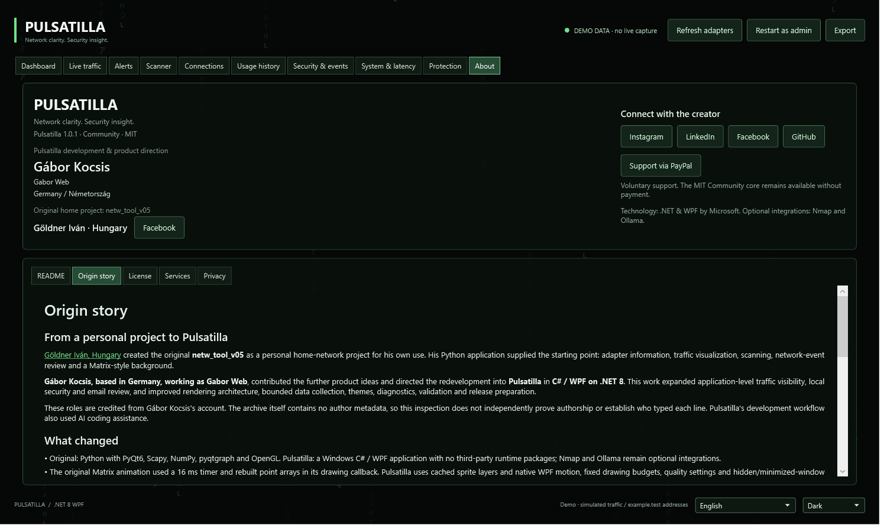

# Original project review

Review date: 2026-10-05. Subject: the supplied `netw_tool_v05.zip` and Pulsatilla
at Git baseline `240cdaba985926195ff5bd6c792c12dcc69188dc`, before the origin-story additions.
Contributor roles are documented in [ORIGIN.md](ORIGIN.md).

## Inspection method and provenance

The ZIP's directory, Python text and image metadata were read without extracting or
executing the project. Its content was treated as reference material, not instructions.
No original source or logo has been copied into this repository by this review.

- ZIP size: 89,268 bytes.
- SHA-256: `90e7e063aca3b2096ed1695c2faf350a341cd30475227f368b601c62efe1c1e5`.
- Contents: nine Python modules and `logo.png`; no Git history, README, license or dependency manifest.
- Python source: 105,283 bytes; 3,288 physical lines / 2,564 nonblank lines, including comments.
- Counting method: normalize CRCRLF/CRLF/LF line endings and omit the trailing empty split element.
- Pulsatilla baseline: 31 C# files / 4,156 physical lines and four XAML files / 865 lines;
  generated `bin`/`obj`, JSON catalogs and validation tools excluded. Size is not a productivity measure.

No named author, copyright holder, license notice or public upstream repository URL was
found in the archive. Göldner Iván's creator role and personal/home-use purpose are recorded
from Gábor Kocsis's supplied account. His separately supplied
[Facebook profile](https://www.facebook.com/goldnerivan#) is a contributor reference,
not independent proof of code authorship or an upstream repository.

The module headers use `v0.1.2`, `v0.1.3` and `v0.1.4`; `ui.py` describes the application
as “vizisiki network tool v0.1.4 – Matrix Glow Edition”. The supplied ZIP/project is called
`netw_tool_v05`. These labels do not establish a release sequence or date.

The PNG metadata names Adobe ImageReady/Photoshop CS6, but not an individual creator or
license. The Adobe toolkit's `2012/02/06` string is software metadata, not the project's date.

## Archive dates

These are the stored entry timestamps, without an assumed timezone:

| Entry | Uncompressed bytes | Stored last-write timestamp |
| --- | ---: | --- |
| core.py | 9,543 | 2025-11-27 19:32:02 |
| exporter.py | 3,281 | 2025-11-26 22:45:38 |
| heatmap.py | 5,275 | 2025-11-27 17:47:12 |
| logo.png | 61,675 | 2025-11-28 02:43:46 |
| main.py | 812 | 2025-11-27 21:40:54 |
| rightpanel.py | 33,400 | 2025-11-28 02:53:58 |
| scanner.py | 6,254 | 2025-11-26 23:05:40 |
| security.py | 5,440 | 2025-11-26 22:42:58 |
| splash.py | 711 | 2025-11-27 21:40:26 |
| ui.py | 40,567 | 2025-11-28 01:34:52 |

The source timestamps span **28 hours, 11 minutes**, across **2025-11-26–28**. The reasonable
inference is a late-November 2025 saved snapshot. These are neither verified start/finish
dates nor a record of 28 hours of work. ZIP date/time fields use MS-DOS encoding with
two-second precision and are distinct from UTC; they may be preserved or changed by
copying/archiving. [PKWARE ZIP specification, section 4.4.6](https://pkware.cachefly.net/webdocs/casestudies/APPNOTE.TXT).

The received ZIP's filesystem creation/last-write date was 2026-10-05; that is receipt/copy
metadata and does not date the original source.

## Pulsatilla publication history

- First import: [`ad71d0b`](https://github.com/acsokis/pulsatilla/commit/ad71d0b6d6e273cbcec29b0b20676d35ce8969a1), **2026-10-05 19:35:05 +02:00**.
- Follow-up funding/publication-kit commit: [`240cdab`](https://github.com/acsokis/pulsatilla/commit/240cdaba985926195ff5bd6c792c12dcc69188dc), **2026-10-05 19:49:38 +02:00**.

The first commit imported an already developed application. The 14-minute gap between
these commits does not measure the development or porting time. No earlier development
history is present in this repository.

## Functional and architectural comparison

This is a static source review, not a runtime certification or performance benchmark.
Original line references use the normalized line counting described above. Current links
point to the inspected baseline so subsequent edits do not change the referenced version.

| Area | Original Python project | Pulsatilla |
| --- | --- | --- |
| Platform | PyQt6, Scapy, NumPy, pyqtgraph, OpenGL | C# / WPF on .NET 8 and built-in Windows/.NET APIs; optional Nmap/Ollama |
| Matrix background | 90 × 45 grid, 16 ms timer, loops and point-array allocations in paint (`ui.py:89–154`) | Cached sprite strips and three/four retained animated layers, fixed budgets, quality settings and visibility suspension ([MatrixRain.cs](https://github.com/acsokis/pulsatilla/blob/240cdaba985926195ff5bd6c792c12dcc69188dc/Pulsatilla.Wpf/MatrixRain.cs)) |
| Throughput | Smoothed whole-machine byte-counter differences, labeled B/s despite 600 ms sampling without elapsed-time division (`ui.py:617,800–827`) | Selected-adapter counter deltas divided by actual elapsed seconds; interactive chart and bounded 1,800-sample history ([MainWindow.xaml.cs](https://github.com/acsokis/pulsatilla/blob/240cdaba985926195ff5bd6c792c12dcc69188dc/Pulsatilla.Wpf/MainWindow.xaml.cs#L183), [VisualTrafficChart.cs](https://github.com/acsokis/pulsatilla/blob/240cdaba985926195ff5bd6c792c12dcc69188dc/Pulsatilla.Wpf/VisualTrafficChart.cs)) |
| Port scanning | Ping/reverse DNS, quick scan and optional Nmap; full scan starts 1,024 threads (`scanner.py:128–150`) | Async TCP scan with concurrency capped at 96; address validation and Nmap argument-list handling ([MainWindow.xaml.cs](https://github.com/acsokis/pulsatilla/blob/240cdaba985926195ff5bd6c792c12dcc69188dc/Pulsatilla.Wpf/MainWindow.xaml.cs#L321)) |
| Capture | Scapy IP/ARP packets, HEX, heatmaps, histogram and IP rankings | Raw IPv4 capture, bounded packet queue, parsed protocol/flows, local endpoint-owner attribution and usage history |
| DNS/security events | Each DNS response also emits a timeline ALERT; multiple answers trigger poisoning suspicion (`ui.py:745–752`, `security.py:116–136`) | Ordinary rotation quiet by default; cooldown/window heuristics for scan/SYN/RDP/rebinding signals ([NetworkThreatMonitor.cs](https://github.com/acsokis/pulsatilla/blob/240cdaba985926195ff5bd6c792c12dcc69188dc/Pulsatilla.Wpf/NetworkThreatMonitor.cs)) |
| IP/software sources | IP packet rankings; some protocol analytics inferred from port numbers (`rightpanel.py:912–927`) | Expandable IP details and separate local-application rankings using parsed packets; device-name/ownership limits documented |
| Firewall | Missing log file prompts code to enable firewall logging automatically (`rightpanel.py:396–425`) | Read-only log viewer; application block/unblock rules use separate explicit confirmation |
| GeoIP | Synchronous HTTP request on IP-row selection (`ui.py:671–680`, `rightpanel.py:734–750`) | Explicit asynchronous HTTPS lookup rejecting common local/private ranges ([MainWindow.xaml.cs](https://github.com/acsokis/pulsatilla/blob/240cdaba985926195ff5bd6c792c12dcc69188dc/Pulsatilla.Wpf/MainWindow.xaml.cs#L464)) |
| Additional scope | No equivalent local email/exposure-review implementation found | MIME/email/phishing review, sender lists, watched-email CSV/JSON report review, app policies, themes, diagnostics, validation, offline About documents and distribution/support preparation |

Pulsatilla is not a strict superset of the original. Scapy's link-layer/ARP capture and the
original heatmap differ from raw IPv4 capture and the current source views. Neither version
implements a VPN or live dark-web search. Source inspection supports the stated changes;
it cannot quantify faster rendering, overall reliability or effectiveness against attacks.

## Reconstruction-effort estimates

Actual historical hours cannot be recovered. For planning only, a broad engineering judgment is:

- Original Python prototype: **20–80 engineering hours**.
- C#/WPF redevelopment with the inspected new features, validation and packaging:
  **60–200 engineering hours**, additional to the prototype estimate.

Assumptions: an experienced developer, available requirements/reference, existing frameworks
and development-machine verification. These are independent estimates of recreating the
observed scope, not elapsed calendar time or hours attributed to either contributor.
AI assistance, pre-existing components, hardware/debugging conditions and experience can
change them substantially. They exclude long-term maintenance, production service delivery,
formal penetration testing and a native-language editorial review. Line count and timestamps
were not converted into working hours.

## Rights and limits

Contributor credit does not itself establish a license, ownership transfer or permission
to relicense the original. The supplied ZIP has no license notice; Pulsatilla's existing
MIT notice cannot grant rights to another person's original work. Reuse permission remains
to be documented. See [GitHub's licensing guidance](https://docs.github.com/en/repositories/managing-your-repositorys-settings-and-features/customizing-your-repository/licensing-a-repository).

The archive is retained only as the user-supplied comparison reference, and is not distributed
in the repository or release package. This review does not determine who authored individual
lines, whether AI was used for the original, or whether either contributor's historical work
matched these planning estimates.
