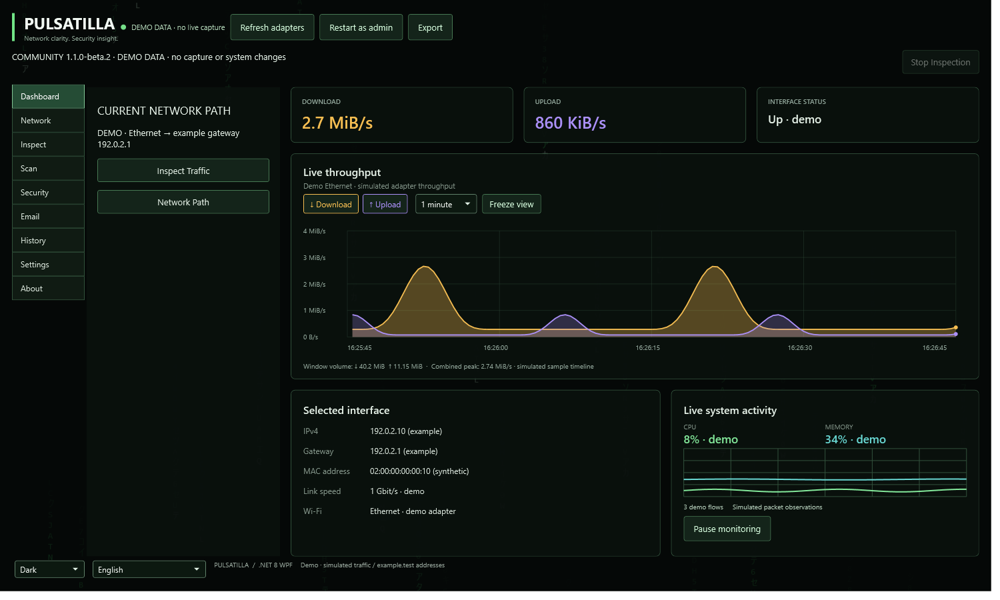
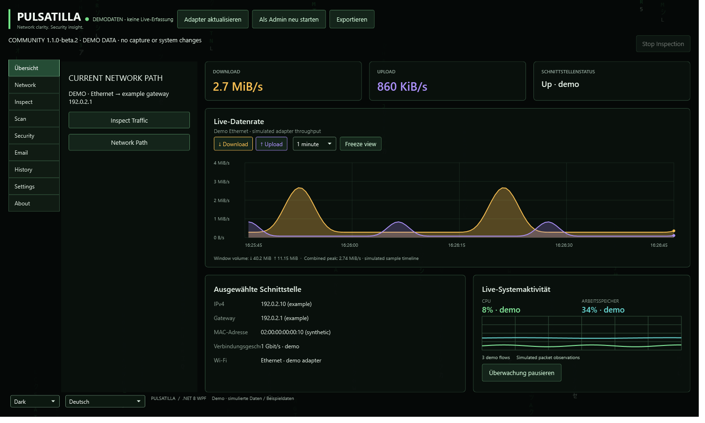
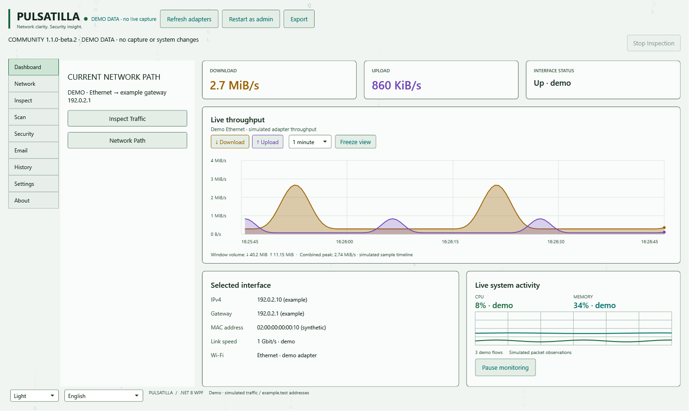
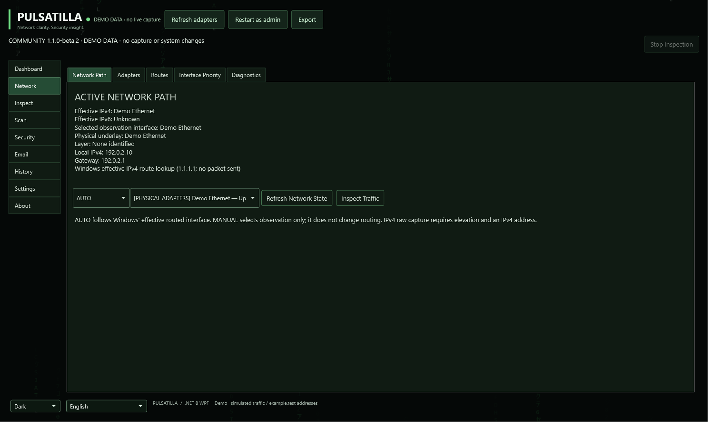
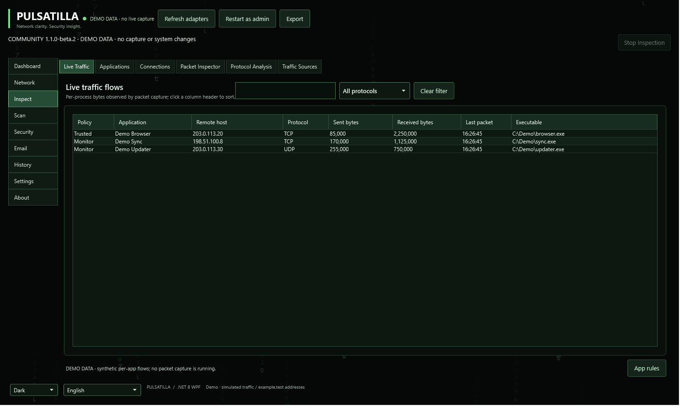
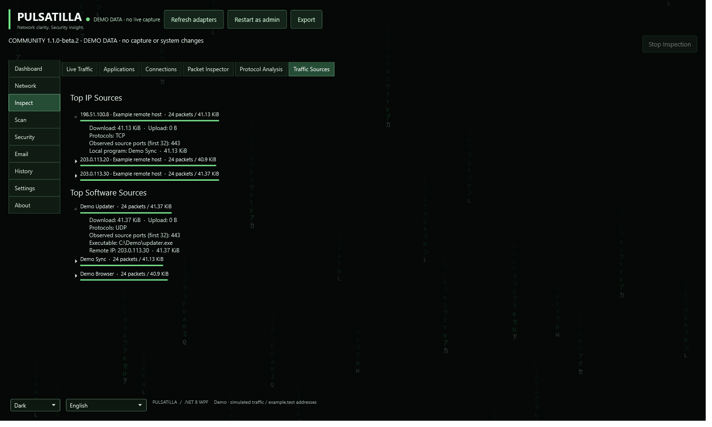
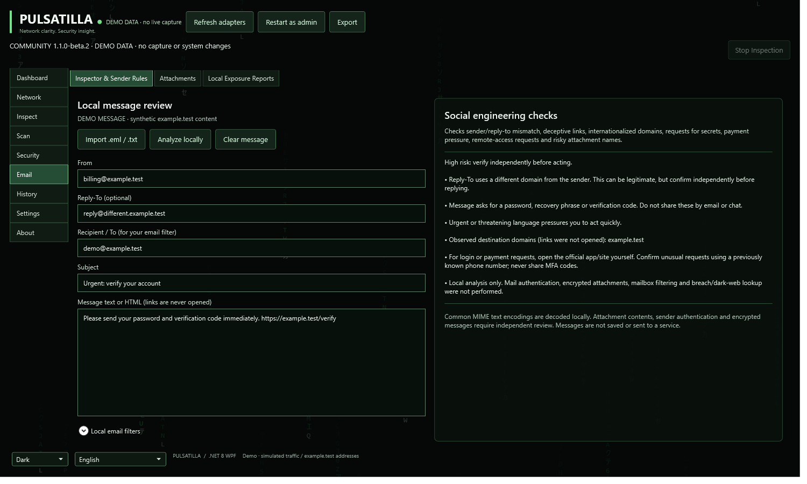
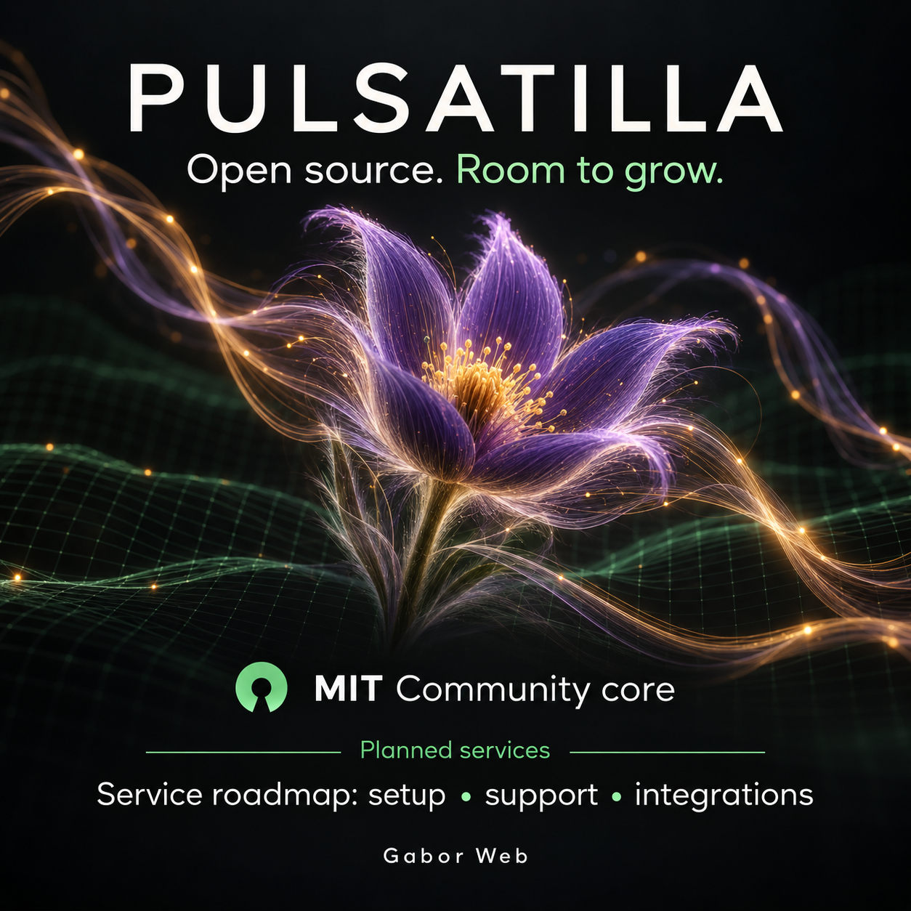

# Pulsatilla publication kit

English and German launch materials by Gabor Web / Gábor Kocsis, updated on 2026-10-06.
Pulsatilla development started on **2026-10-05 at 13:55 CEST (Germany / Europe/Berlin)**,
as supplied by Gábor Kocsis.
The source project is public at [acsokis/pulsatilla](https://github.com/acsokis/pulsatilla).
Download the Community application from [GitHub Releases](https://github.com/acsokis/pulsatilla/releases).
Get the complete [share-ready publication ZIP](https://github.com/acsokis/pulsatilla/releases/download/v1.1.0-beta.1/pulsatilla-publication-kit-1.1.0-beta.1.zip).
The released ZIP is the beta.1 snapshot. For the current beta.2 source-preview screenshots and copy page, download the current repository ZIP and open docs/launch/share.html locally.

## Ready-to-copy posts

Open **[share.html](share.html)** locally for a visual publication page with one-click
copy buttons, English/German posts and articles, and downloadable images. On GitHub,
HTML is displayed as source; download the repository ZIP and open the file in a browser.
The page includes direct application/kit download links and English/German sections for
voluntary support and planned service opportunities.

| Platform | English | Deutsch |
| --- | --- | --- |
| LinkedIn | [English post](linkedin-en.md) | [Deutscher Beitrag](linkedin-de.md) |
| Facebook | [English post](facebook-en.md) | [Deutscher Beitrag](facebook-de.md) |
| Long article (LinkedIn/Facebook) | [English article](article-en.md) | [Deutscher Artikel](article-de.md) |

The files contain final post text. Publication to LinkedIn/Facebook has not been performed.
Use [copy notes](COPY-NOTES.md) for captions and service-status wording.

Voluntary development support is available through [PayPal.Me / gaborcarter](https://paypal.me/gaborcarter).
It does not unlock features or buy a service. The commercial direction is a free MIT Community core plus separately scoped setup,
diagnostics, training, support and integration work. Optional hosted services are a later
roadmap. There is no active checkout, subscription or external exposure provider.
See [commercial options](commercial-overview.md) and [SEO/GEO text](seo-geo.md).

## App screenshots — synthetic demonstration data

Updated **6 October 2026**, these PNGs render the **current Community 1.1.0-beta.2 XAML, workflow navigation and controls**. They describe the source preview, not the older downloadable beta.1 interface. Every screenshot labels
demonstration data. Traffic, local applications, IP addresses, messages and event examples
are synthetic; they are not captures of a live network or evidence of actual attacks.
The UI operation handlers are removed for rendering. Nothing is sent to a provider and
no profile, mailbox, packet capture or firewall operation runs.

All screenshots are 1500 × 900 PNGs. The German interface is the existing initial language
catalog; some technical labels remain in English. No translation expansion was performed.

### Dashboard / Übersicht





### Network path



### Application traffic and source detail




### Local email review



Regenerate from the repository root on Windows with the .NET 8 SDK:

```powershell
dotnet run --project tools/Marketing.Screenshots/Marketing.Screenshots.csproj -c Release
```

## Marketing illustrations — AI generated

These are brand concept illustrations made with the built-in `image_gen` tool. They are
not application screenshots, performance measurements or live service demonstrations.
The complete [generation prompts](IMAGE-PROMPTS.md) are included.

| File | Format | Suggested use |
| --- | --- | --- |
| [English launch banner](assets/marketing/pulsatilla-launch-en.png) | 1672 × 941 | Launch post / wide hero |
| [English service roadmap](assets/marketing/pulsatilla-services-roadmap-en.png) | 1254 × 1254 | Square post introducing planned services |
| [German service roadmap](assets/marketing/pulsatilla-services-roadmap-de.png) | 1672 × 941 | German launch and planned service post |
| [Logo PNG](assets/marketing/pulsatilla-logo.png) / [SVG](assets/marketing/pulsatilla-logo.svg) | 1280 × 320 | Reusable flower/network brand mark and wordmark |

The GitHub README leads with current product information and the actual Dashboard preview. Brand banners remain available here for sharing.
Original-project attribution remains in About and the separate technical origin documents;
the copy-ready publication material focuses on Pulsatilla and Gabor Web.

The separate SVG/PNG logo is vector artwork rendered with WPF, rather than an AI-generated image.





Use a Dashboard image first when explaining the app, and a separately labeled illustration
when presenting the brand or service roadmap. Preview the crop in the platform editor and
keep the title and planned-services label visible. Attach alt text from `seo-geo.md` and
include the repository link in the post. No advertisement purchase or scheduled post is set up.

Rebuild the copy page after editing a post or article:

```powershell
node tools/Build.Publication.mjs
```

Create a versioned ZIP with every text and image, keeping the relative links intact:

```powershell
./tools/Package.Publication.ps1
```

The output is `dist/pulsatilla-publication-kit-<version>.zip` with a SHA-256 file.
Extract it and open `share.html` inside the extracted folder.
